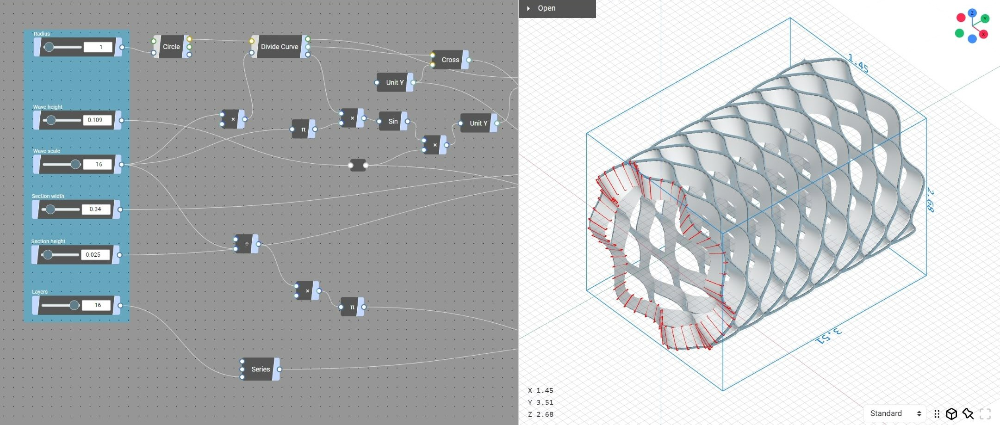

# Nodi

Nodi (β) is an online node-based geometry design tool & social development environment.

- [nodi3d.com](https://nodi3d.com) (*Tested on Chrome only*)
- [User's Guide](https://nodi3d.github.io/docs)
- [Developer's Guide](https://nodi3d.github.io/docs/developer/guide)

## Acknowledgements

The following libraries are that Nodi mainly depends on.

- [three.js](https://github.com/mrdoob/three.js/)
- [verb](https://github.com/pboyer/verb)

## Contributing

- If you want to add, update, translate, or modify the [documentation](https://nodi3d.github.io/docs), please check the docs repository. [repository](https://github.com/Nodi3d/docs)
- If you want to submit a bug report or have a general question about how use Nodi, then please start a conversation at the [forum](https://forum.nodi3d.com).
- If you want to submit a change or a patch, please create a fork via Github. Once you have made the modifications, make sure that the all tests pass, and then please send a pull request. [guide](https://nodi3d.github.io/docs/developer/guide)

## Author

[Masatatsu Nakamura](https://mattatz.org)

## License

Nodi is published under the Apache License, Version 2.0. See the included [LICENSE file](/LICENSE).
